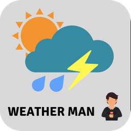

# Weatherman

> ### A cool app to know realtime weather information for your location.

### **Ask the weatherman !**

Use this app to get latest real time weather updates for your location.
Search by either using cityname or your locations coordiantes.

Uses OpenWeatherMap API to fetch latest weather information. Stylings are done using Bootstrap 4.
Used FontAwesome 5 Icons and weather-icons for showing beautiful weather conditions.
Used animate.css for animating the title.
Uses HTML5 geolocation API to detect client's location(stored in client's browser's localstorage for improved performance)

#### References:

* https://openweathermap.org/

* https://developer.mozilla.org/en-US/docs/Web/API/Fetch_API

* https://daneden.github.io/animate.css/

* https://getbootstrap.com/

* http://erikflowers.github.io/weather-icons/

* https://fontawesome.com/get-started

Made with ️❤︎ by **[Rocky](https://rocky93.github.io/ "Abhijeet Saxena")**

---
